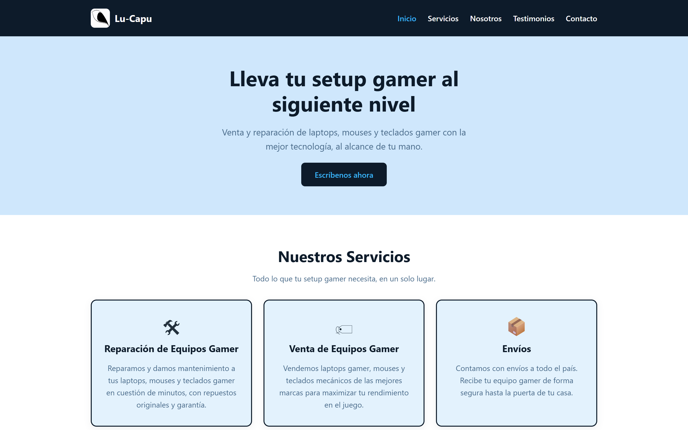
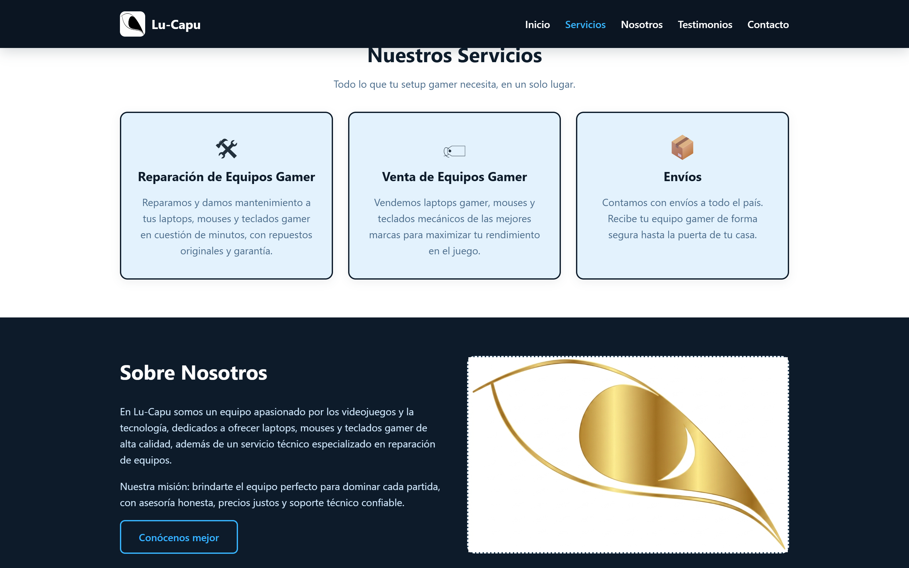
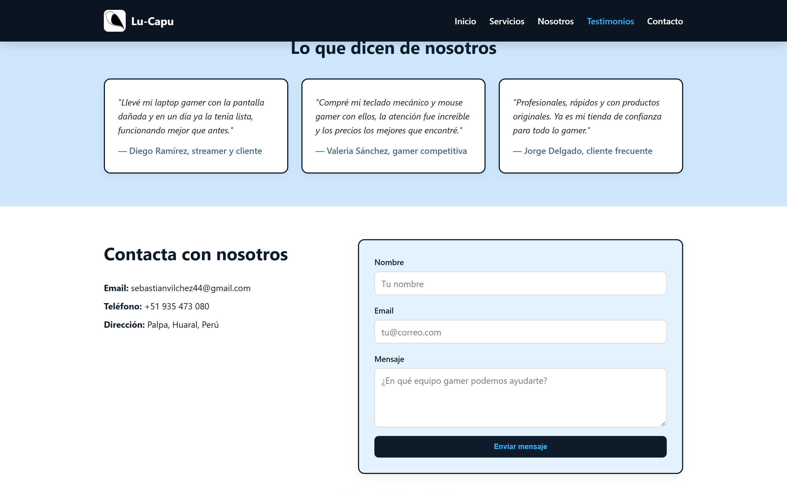
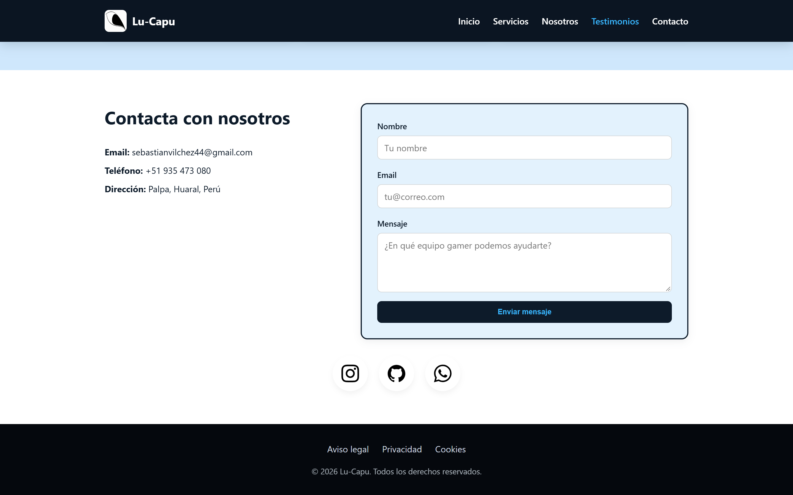
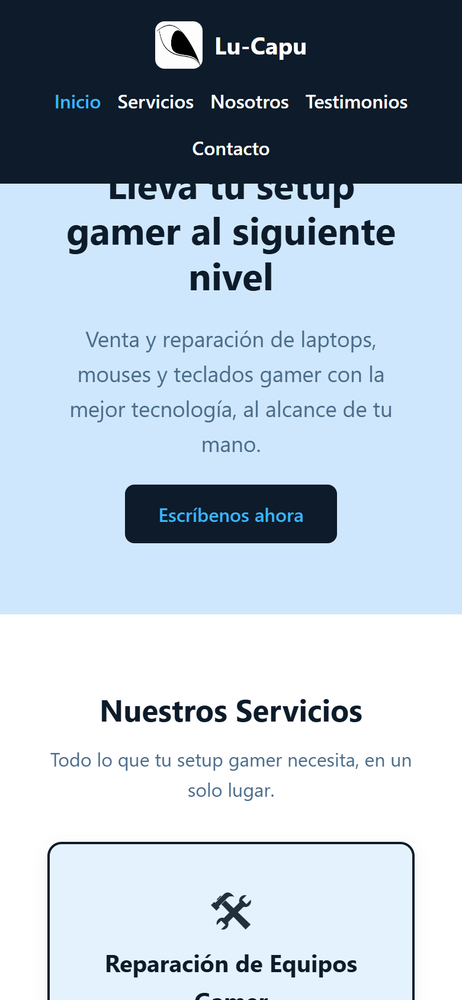

# Lu-Capu · Tienda y reparación de equipos gamer

Landing page para una tienda y servicio técnico de equipos gamer: venta de
laptops, mouses y teclados, más reparación y mantenimiento. HTML, CSS y
JavaScript sin dependencias ni build.



## 🛠️ Tecnologías


Sin frameworks, sin bundler, sin `npm install`. La única dependencia externa es
la fuente **Poppins** desde Google Fonts y los SVG de redes sociales están
inline en el HTML.

## ✨ Características

- **Hero** con titular, subtítulo y llamada a la acción
- **Servicios:** reparación de equipos, venta de equipos y envíos
- **Sobre nosotros** con imagen y llamada a la acción secundaria
- **Testimonios** en `<blockquote>` + `<cite>` con autor
- **Contacto** con email, teléfono, dirección y formulario
- **Formulario con validación nativa** vía `checkValidity()` y `reportValidity()`
  en lugar de `alert()`
- **Animaciones de entrada con `IntersectionObserver`** (`data-reveal`), con
  retardo escalonado por elemento vía `data-reveal-delay`
- **Header con sombra** al hacer scroll
- **Scrollspy** que resalta el enlace del nav de la sección actual
- **Iconos de redes** (Instagram, GitHub, WhatsApp) con SVG inline y color de
  marca por variable CSS (`--accent-color`)
- **Fallback sin JavaScript:** los elementos `[data-reveal]` se muestran de
  inmediato si `IntersectionObserver` no existe
- **Responsive** y con `prefers-reduced-motion` respetado

## 🚀 Instalación y uso

No requiere instalación:

```bash
git clone https://github.com/Lu-Capu/landing-gamer-tienda.git
cd landing-gamer-tienda
npx serve .
```

## 📁 Estructura

```
landing-gamer-tienda/
├── index.html    # Contenido, estructura y SVG inline
├── style.css     # Estilos principales (410 líneas)
├── styleR.css    # Solo estilos de los iconos sociales
├── script.js     # Scroll, reveal, scrollspy y formulario
└── img/          # logo.png y logo-dorado.jpg
```

> `styleR.css` es un resto de la plantilla original: quedó separado porque
> solo contiene el bloque `.socials-container`. Si prefieres un único archivo,
> concaténalo al final de `style.css` y quita el `<link>`.

## ✏️ Personalización

| Quiero cambiar... | Dónde |
|---|---|
| Colores y variables | `:root` al inicio de `style.css` |
| Textos y secciones | `index.html` |
| Retardo de las animaciones | atributos `data-reveal-delay="150"` |
| Redes sociales | bloque `.socials-container` al final de `index.html` |
| Datos de contacto | sección `#contacto` |

## 📸 Capturas

**Servicios**



**Testimonios y contacto**

| Testimonios | Contacto |
|---|---|
|  |  |

**Vista móvil**



## 🔗 Demo en vivo

[▶ Ver demo](https://lu-capu.github.io/landing-gamer-tienda/) · [💻 Ver código](https://github.com/Lu-Capu/landing-gamer-tienda)

## ⚠️ Nota sobre el formulario

El formulario tiene `action="#"`: **no envía nada a ningún servidor**, el
JavaScript intercepta el `submit` y muestra "¡Mensaje enviado!" durante 2.5
segundos. Para usarlo en producción hay que conectarlo a un backend, Formspree
o similar.

## 📄 Licencia

[MIT](LICENSE)